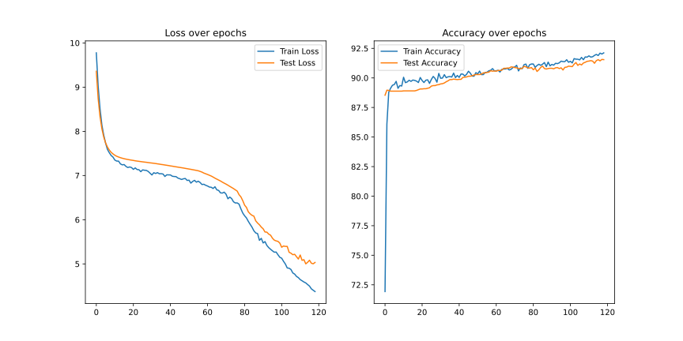
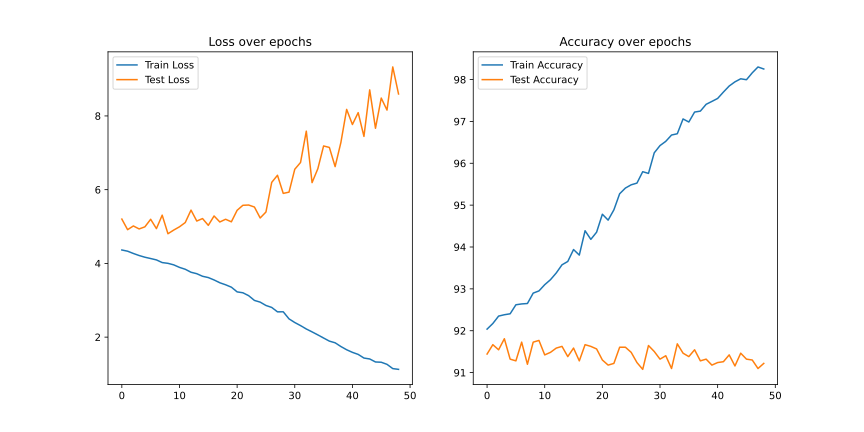

# 多阶段基于 BERT 的多输出文本评估

## 摘要

本项目提出了一种基于预训练 BERT 编码器构建的多输出文本评估框架，用于同时预测多个细粒度评估目标。训练策略分为六个阶段，逐步解冻编码器层并采用分层学习率和正样本加权二元交叉熵损失，实现在3000条摘要数据集上的稳定收敛和鲁棒性能。

## 1. 引言

自动化评估文本内容的多维度特征在政策分析和风险管理等领域具有重要意义，本项目使用 BERT 微调实现多输出分类需求。

## 2. 相关工作

- **BETY 微调**：一次性解冻所有层进行全模型微调。
- **渐进解冻**：分阶段逐步解冻，可稳定模型训练。
- **多任务 vs. 多输出**：多任务学习为每个任务分配头，而多输出模型共享主干、使用独立预测头预测各目标。

## 3. 基础理论

- **自然语言处理中的迁移学习**：微调预训练语言模型利用大规模语料库中学习到的上下文相关表示，BERT 双向 Transformer 捕获深层语义关系，有助于快速适配下游任务。
- **渐进式解冻**：按层解冻可保留底层特征，减少灾难性遗忘。分层学习率遵循差异化设置更新幅度更小。
- **加权池化机制**：通过构建 `filter` 模块，对句子嵌入进行 `sigmoid` 注意力权重计算，类似自注意力，关注关键信息。
- **多输出分类**：从共享表示中共同预测多个目标，与多任务学习共享参数，但需平衡各头之间的相互影响。
- **不平衡处理**：基于负样本数与正样本数之比的 `pos_weight` 对二元交叉熵加权，减轻多数类偏差。
- **BERT 架构与预训练**：
  - **Transformer 编码器**：多层自注意力结构，捕获长程依赖。
  - **多头自注意力**：分头投影并行学习多方面表示。
  - **位置编码**：为 `token` 添加位置向量，保留顺序信息。
  - **MLM 与 NSP**：掩码语言建模和下局预测联合预训练。
  - **层归一化与残差连接**：稳定深层网络梯度。
- **AdamW 优化器与权重衰减**：解耦权重衰减与梯度更新，分阶段调整权重衰减控制过拟合。
- **差异化学习率**：接近输出层的参数使用较大学习率，接近输入层的参数使用更小的学习率。
- **Dropout 与 LayerNorm**：自定义头部中的 `Dropout` 与 `LayerNorm` 提高训练稳定性和泛化。

### 3.1. 基于注意力的池化和均值池化

学习到的 `filter` 头部实现了类似于自注意力的 `sigmoid` 门控机制，允许对 `token` 进行自适应权重分配，而非均匀分配，这在长摘要中可以避免关键信号被稀释。

### 3.2. 共享头部与独立头部

通过使用包含 `{filter, assessor}` 对的模块结构，在共享上下文嵌入与任务特定参数化之间取得平衡，从而更小化输出维度之间的干扰。

## 4. 方法论
### 4.1. 模型架构

- **编码器**：`BertModel.from_pretrained`，隐藏维度 `H=768`，提供 `token` 嵌入和池化输出。
- **Filter 模块**：采用 `_build_filter` 构建的 `sigmoid` 注意力层，对句子嵌入进行加权池化。
- **Assessor 模块**：采用 `_build_assessor` 构建的两层 MLP，根据池化结果生成各目标 `logits`。
- **输出头**：将每个目标与 `{filter, assessor}` 一一对应。

#### 4.1.1. 数学表达

设输入摘要被分割为 $n$ 个句子，每句被分词为 $L$ 个词，句 $i$ 中 词 $t$ 对应 的 `token` 嵌入 $h_{i,t} \in  \mathbb{R}^{H}$，位置掩码 $m_{i,t} \in \{0, 1\}$。

1. **掩码平均池化**
   对每个句子 $i$，计算：
   ``` math
   e_{i} = \frac{\sum_{t=1}^{L}m_{i,t} \odot h_{i,t}}{\sum_{t=1}^{L}m_{i,t}+\epsilon} \in \mathbb{R}^{H}
   ```
   其中 $\odot$ 为逐元素乘法。
2. **Filter（sigmoid 注意力权重）**
   所有句子的嵌入为 $e = [e_{1}, \dots, e_{n}] \in \mathbb{R}^{n \times H}$，$e_{i}$ 为掩码平均池化得到的句子嵌入，计算：

   ``` math
   a = \sigma(W_{f,2}g(W_{f,1}e+b_{f,1})+b_{f,2}) \in \mathbb{R}^{n \times H}
   ```

   其中 $g(\cdot) = \mathrm{LeakyReLU}(\mathrm{LayerNorm}(\cdot))$。
3. **加权平均池化**
   根据 `filter` 注意力 $a=[a_{1}, \dots, a_{n}]^{\mathrm{T}}$，计算：

   ``` math
   s = \frac{\sum_{i=1}^{n}a_{i}^{\mathrm{T}} \odot e_{i}}{\sum_{i=1}^{n}a_{i} + \epsilon} \in \mathbb{R}^{H}
   ```

4. **评估器（MLP头部）**
   对于每个目标头部 $j$，应用两层 MLP：
   
   ``` math
   z_{j}^{(1)} = \mathrm{ReLU}(W_{j}^{(1)}s + b_{j}^{(1)}) \\y_{j} = W_{j}^{(2)}z_{j}^{(1)} + b_{j}^{(2)},\ \ \ y_{j} \in \mathbb{R}^{C_{j}}
   ```
   
   其中 $C_{j}$ 是目标 $j$ 的类别数，$y_{j}$ 为部分评估目标 `logits`。
5. **最终输出**
   所有评估输出拼接：
   
   ``` math
   f(h, m) = [y_{1}, \dots, y_{J}] \in \mathbb{R}^{\sum_{j}c_{j}}
   ```
   
   拼接结果经 `sigmoid` 映射到 `[0,1]`，得到顺位评估。
6. **数学表达式总结**
    模型的前向传播可表示为符合函数：
    
    ``` math
    f(h, m) = \bigoplus_{j} \left(
        W_{j}^{(2)} \cdot {
            \mathrm{ReLU} \left(
                W_{j}^{(1)} \cdot {
                    \frac{
                        \sum_{i=1}^{n} \frac{
                            \sum_{t=1}^{L} m_{i,t} \odot h_{i,t}
                        }{
                            \sum_{t=1}^{L} m_{i,t} + \epsilon
                        } \odot \sigma \left(
                            W_{f,2} \cdot g\left(
                                W_{f,1} \cdot \frac{
                                    \sum_{t=1}^{L} m_{i,t} \odot h_{i,t}
                                }{
                                    \sum_{t=1}^{L} m_{i,t} + \epsilon
                                }
                            \right) + b_{f,2}
                        \right)
                    }{
                        \sum_{i=1}^{n} \sigma \left(
                            W_{f,2} \cdot {
                                g \left(
                                    W_{f,1} \cdot {
                                        \frac{
                                            \sum_{t=1}^{L} m_{i,t} \odot h_{i,t}
                                        }{
                                            \sum_{t=1}^{L} m_{i,t} + \epsilon
                                        }
                                    } + b_{f, 1}
                                \right)
                            } + b_{f, 2}
                        \right) + \epsilon
                    }
                } + b_{j}^{(1)}
            \right)
        } + b_{j}^{(2)}
        \right)
        ```
        
        其中 $\odot$ 表示逐元素乘法，$g(\cdot) = \mathrm{LeakyReLU}{(\mathrm{LayerNorm}{(\cdot)})}$，$\bigoplus$ 表示向量拼接。

#### 4.1.2 BERT 编码器数学表达

设输入序列为 $X = [x_1, \dots, x_L], x_t = E_{tok}(w_t) + E_{pos}(t) \in \mathbb{R}^{H}$。第 $\ell$ 层 Transformer 块：

1. **多头自注意力（$H_{head}$ 个头）**
   对于头部 $h = 1 \dots H_{head}$：
   
   ``` math
   Q^{h} = XW_{Q}^{h} + b_{Q}^{h}, K^{h} = XW_{K}^{h} + b_{K}^{h}, V^{h} = XW_{V}^{h} + b_{V}^{h} \\ \mathrm{head}_{h} = \mathrm{softmax}{\left(\frac{Q^{h}K^{h\mathrm{T}}}{\sqrt{{d_{k}}}}\right)}
   ```
   
   然后头部拼接：
   
   ``` math
   \mathrm{MHSA}(X) = [\mathrm{head}_1, \dots, \mathrm{head}_{H_{head}}]W^{O} + b^{O}
   ```
2. **残差+归一化**
   
   ``` math
   \tilde{X} = \mathrm{LayerNorm}(X + \mathrm{MHSA}(X))
   ```
3. **前馈网络**
   
   ``` math
   \mathrm{FFN}(\tilde{X}) = \mathrm{GeLU}(\tilde{X}W_1 + b_1)W_2 + b_2
   ```
4. **残差+归一化**
   
   ``` math
   X^{(\ell + 1)} = \mathrm{LayerNorm}(\tilde{X} + \mathrm{FFN}(\tilde{X}))
   ```

经过 $L_{enc}$ 个这样的块后，BERT 编码器返回 `token` 输出（`last_hidden_state`）和一个池化表示（`pooler_output`），其计算方式为：

``` math
u = \mathrm{tanh}(H_{E}^{(L_{enc})}[\mathrm{CLS}]W_{pool} + b_{pool})
```

其中 $H_{E}^{(L_{enc})}[\mathrm{CLS}]$ 是 `[CLS]` 在最终层的隐藏状态，记 $u$ 为 `pooler_output`，$H_{E}^{(L_{enc})}$ 为 `last_hidden_state`，`last_hidden_state` 作为下游任务输入。

### 4.2. 损失与不平衡处理

对于每个输出类别使用 `logits` 的二元交叉熵，并进行正样本加权 $\mathrm{pos_weight} = \sqrt{N_{neg}} / \sqrt{N_{pos}}$。

### 4.3. 渐进微调

分六阶段逐步解冻：

阶段(`phase`) | 解冻层(`layers_to_unfreeze`) | 学习率分组(`param_groups`) | 迭代次数(`epochs`) | 权重衰减(`weight_decay`)
:--: | :-- | :-- | :--: | :--:
| 1 | - | heads: 1e-6 | 21 | 1e-3 |
| 2 | +pooler | heads:1e-6, pooler:8e-7 | 35 | 1e-3
| 3 | +encoder[-1:] | heads:1e-6, pooler:8e-7, -1:4e-7 | 21 | 1e-3
| 4 | +encoder[-3:-1] | heads:1e-6, pooler:1e-6, -1:8e-7, -3:-1\:4e-7 | 21 | 1e-3
| 5 | +encoder[-7:-3] | heads:1e-6×3, -3:-1\:8e-7, -7:-3:4e-7 | 21 | 1e-3
| Final | BERT | heads:1e-6×4, -7:-3:8e-7, rest:4e-7, emb:2e-7 | 49 | 1e-4

### 4.4. 算法伪代码
#### 4.4.1. 总训练流程

``` markdown
# 多阶段微调主流程
输入：数据集 `D`，模型 `f`，分词器 `T`，最大分词长度 `L`，正样本加权 `W`，阶段配置 `P`
对于每个 `phase` in `P`：
    解冻模型中的解冻层: `layers_to_unfreeze`
    构建 `AdamW` 优化器 (`param_groups`, `weight_decay`)
    对于 `epoch` = 1,...,`epochs`：
        对于每个 `batch` in DataLoader(`训练集` in `D`，批量大小=`6`)：
            前向：`outputs = f(inputs)`
            计算损失：`loss = compute_loss(outputs, targets, W)`
            反向：`loss.backward()`
            更新：`optimizer.step()`
```

#### 4.4.2. 数据集处理

``` markdown
# 数据集处理
输入：原始文件对应的 `Dataframe` 对象 `df`，分词器 `T`，最大分词长度 `L`
对存在 **数据缺失** 的记录进行 **删除**
对每条摘要 `summary`：
    按正则 `\.\s(?=[A-Z])` **切分**句子
    使用分词器 `T` 进行 **编码**
```

## 5. 数据说明

- **原始数据**：`analysis_result_simple_format_3000_with_summary.xlsx`（3000条记录）。
- **摘要切分**：对摘要进行分句处理。
- **分词**：使用 `BertTokenizer` 并设置 `max_len=256`。
## 6. 实验与结果

数据集的 `2/3` 用于训练，`1/3` 用于测试，随机种子为 `20040508`。如下图所示，经过 5 个阶段共 119 次迭代的学习，各阶段损失稳定下降且准确率稳定提升，在 98 和 119 两个检查点的平均测试准确率分别为 `90.89%`、`91.54%`。


如下图所示，在 119 次迭代后，继续进行 49 次迭代，模型在训练集上的损失下且准确率持续增加，在测试集上损失持续上升，准确率较为稳定，呈现过拟合趋势。经过 6 个阶段共 168 次迭代训练后平均测试准确率为 `91.22%`。


由上可得，模型在五个阶段共119次迭代训练后，达到最佳性能。

## 7. 结论

多阶段解冻结合分层学习率与加权损失，可在多输出任务中兼顾稳定性与收敛速度。