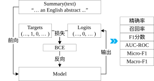
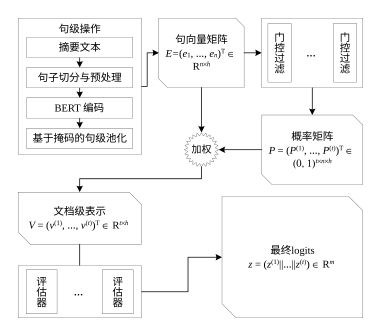

# 基于 Transformer 双向编码器的文本要点抽取方法

摘要
  本文提出一种基于Transformer双向编码器的文本要点抽取方法。该方法面向句级聚合与任务化判别，围绕模型结构、表示融合与训练判别策略进行系统优化。

本文的主要贡献包括：
  (1) 提出了一种高效适配的模型架构：构建了以预训练BERT为核心、结合句级表示与任务特定按维门控的端到端评估器，并采用多头输出且按固定标签序拼接，确保结构与语义对齐且易扩展。
  (2) 改进了多层次语义表示融合与变长处理：以掩码均值实现由词到句的稳定表示，结合任务化“特征维度”门控实现细粒度筛选；采用列表批与逐样本前向以避免跨样本在句维的过度填充，稳健支持变长摘要。
  (3) 优化了训练与判别策略：采用渐进式解冻与分组学习率提升微调稳定性；以宏AUPRC作为早停与选模指标应对长尾多标签；基于最大化F1进行逐标签阈值选取（单类退化回退0.5），并以正样本加权缓解类不平衡，整体提高可复现性与实用判别性能。

---

本文的提出背景，便于形成应用对象:
  随着互联网信息的爆炸式增长，高效地从海量文本中快速、准确地提取核心信息已成为自然语言处理领域的关键需求。文本要点抽取作为自动文本摘要的核心任务之一，旨在识别并抽取出原始文本中承载核心语义的句子或片段，形成简洁、准确的概要，在新闻聚合、信息检索、舆情分析、知识管理等场景中具有广泛的应用价值。
  传统的文本要点抽取方法主要可分为基于统计特征的方法（如词频、位置、线索词等）、基于图模型的方法（如 TextRank, LexRank）以及基于主题模型的方法（如 LDA）。这些方法在特定场景下取得了一定效果，但通常依赖于人工设计的特征或浅层的语义表示，难以有效捕捉文本深层的语义关联和上下文依存关系，对复杂语境和隐含信息的理解能力有限，导致抽取结果的准确性和泛化性面临挑战。
  近年来，深度神经网络，特别是基于长短期记忆网络和门控循环单元的序列模型，显著提升了语义建模能力。然而，循环神经网络固有的顺序处理特性和梯度消失问题限制了其在长文本建模中的表现，且难以有效利用文本的双向上下文信息。2017年，Vaswani等人提出的Transformer架构，凭借其自注意力机制，能够并行化处理序列并有效建模长距离依赖关系，彻底革新了自然语言处理领域。特别是以BERT为代表的基于Transformer的双向编码器预训练模型，通过在大规模无标签语料上进行掩码语言建模等任务训练，能够学习到丰富的上下文感知的词向量表示，进而提供强大的语义理解能力。
  尽管基于预训练Transformer模型（如BERT、RoBERTa、ELECTRA）的文本表示在各类NLP任务上取得了突破性进展，将其直接应用于文本要点抽取任务仍存在特定挑战：(1) 语义融合与变长建模：现有方法在将细粒度词级表示稳定融合为句级表示、根据任务需求筛选关键特征、以及高效鲁棒地处理变长句子序列方面存在不足；(2)训练与判别策略：在模型微调稳定性、长尾多标签场景下的模型选择标准、自适应判别阈值优化以缓解类别不平衡影响等方面存在局限，制约了模型的可复现性与实际应用性能。
  针对上述挑战，本文提出一种基于Transformer双向编码器的文本要点抽取方法。该方法面向句级聚合与任务化判别，围绕模型结构、表示融合与训练判别策略进行系统优化。

## 1. 引言

本文提出一种基于Transformer双向编码器的文本要点抽取方法，用于从多句长文本中自动识别与量化多维任务需求。为了解决跨句证据稀疏与多任务判别的挑战，提出了句子级表征与任务专用门控机制相结合的轻量化架构，该设计兼顾了跨句信息聚合与任务可解释性的需求。

## 2. 模型整体架构

本方法旨在对给定的英文摘要文本进行多维度评估，判断其在若干任务维度上的相关性。每个任务维度对应一个二元标签（0/1）表示摘要与该任务是否相关。

每条样本的输入包含文本输入与标签两部分。文本输入是一段英文摘要，通常由若干句子组成，可建模为词序列 \( \mathbf{x} = \{w_1, w_2, \dots, w_n\} \)，其中 \( w_i \) 是单词或子词；标签是若干任务维度上的二元向量 \( \mathbf{y} = (y_1, y_2, \dots, y_m) \)，其中 \( y_j \in \{0, 1\} \) 表示该摘要在顺位维度 \( j \) 上的相关性。

模型输出是一个多维逻辑值（logits）向量：
  \[
  \mathbf{z} = (z_1, z_2, \dots, z_m)
  \]
  其中：
  每个 \( z_j \) 是一个实数（无约束范围），表示模型对第 \( j \) 个类别的原始置信度，通过 Sigmoid 函数 \( \sigma(z_j) = \frac{1}{1 + e^{-z_j}} \) 转换为概率 \( p_j \in (0, 1) \)，用于最终的分类决策。

最终预测：
  \[
  \hat{y}_j = \begin{cases}
  1 & \text{if } p_j \geq \tau \\
  0 & \text{otherwise}
  \end{cases}
  \]
  其中 \( \tau \) 是阈值，通常取 0.5，但可调优以优化 F1 分数或精确率、召回率。

由于其本质是多维度分类，采用二元交叉熵（Binary Cross-Entropy, BCE）作为损失函数：
  \[
  \mathcal{L}(p, y) = \sum^{m}_{j}\ell_j, \quad
  \ell_j = -w_j \left[ y_j \log p_j + (1 - y_j) \log (1 - p_j) \right]
  \]
  其中：
  - \( p_j = \sigma(z_j) \) 是模型预测的概率
  - \( y_j \) 是真实标签
  - \(w_j\) 是基于负样本数与正样本数之比的正样本加权，用于减轻多数类偏差。

## 3. 网络设计

本方法以预训练BERT（Transformer 双向编码器）为主干编码器，通过对输入摘要进行句级切分与编码，再通过可学习的门控过滤完成在句级-特征级联合维度上的重要性重加权，最后由多任务评估器输出多任务维二分类目标。

为保持句级可解释性的同时获得稳健的文档级表示，进行了“句级编码+面向句向量的下游聚合”设计。

对于给定的摘要文本 s，先进行轻量清洗，去除特殊字符，随后采用基于正则的句界识别，得到句子序列 \(s \mapsto (\tilde{s}_1, \tilde{s}_2, \dots, \tilde{s}_n)\)。每个句子 \( \tilde{s}_i \) 通过本地 BERT tokenizer 映射为子词序列，并统一填充/截断至固定长度 \( L=\texttt{MAX\_LEN}\)，得到子词序列 \(X_i = (t_{i1}, \dots, t_{iL})\) 与注意力掩码 \( m_i = (m_{i1}, \dots, m_{iL}) \in \{0,1\}^L\)，在句维上进行堆叠得到张量 \( X \in \mathbb{R}^{n \times L} \)、\( M \in \{0,1\}^{n \times L}\) 后使用具有预训练权重信息的 `BertModel` 对句子进行批量编码，得到各句的 token 级隐状态 \(H \in \mathbb{R}^{n \times L \times h}\)。为消除长度与填充的影响，对每个句子做基于注意力掩码的均值池化，得到句向量 \( e_i \in \mathbb{R}^{h} \)。

为在句级结构上实现任务相关的精细选择，设计了“句级-特征级门控”机制。门控在每个特征维度上学习可独立调节的权重 \(g_{\phi^{(t)}}: \mathbb{R}^{h} \to (0,1)^{h}\)，从而在文档级融合前进行更细粒度的筛选与强调。

句向量矩阵为 \(E = (e_1, \dots, e_n)^\top \in \mathbb{R}^{n \times h}\) 在第 \(t\) 个任务维度上经门控过滤输出与输入同维的元素级概率 \(p_i^{(t)} \in (0,1)^{h}\)，将所有句子的门控向量按句维堆叠，得到任务级门控 \(P^{(t)} \in (0,1)^{n \times h}\)，允许同一句的不同子空间维度对不同任务产生不同贡献。

对第 \(t\) 个任务维度，通过句向量矩阵 \(E = (e_1, \dots, e_n)^\top \in \mathbb{R}^{n \times h}\) 与任务级门控 \(P^{(t)} \in (0,1)^{n \times h}\) 在句维上的加权平均得到该任务特定文档级表示 \(v^{(t)} \in \mathbb{R}^{h}\)。

对于任务特定文档表示 \(v^{(t)} \in \mathbb{R}^{h}\)，在任务维度 \(t\) 上经评估器映射到特征维原始置信 logits \(z^{(t)} \in \mathbb{R}^{k_t}\)。

## 4. 关键实现与实验流程

### 4.1 数据管道

对输入的原始数据，剔除任一字段存在缺失值的样本并重置行索引以保持连续；去除特殊字符 `*`，以避免对 tokenizer 的干扰；为保证可复现性，设置随机种子。

使用正则表达式 `[\.;]\s` 在句号或分号后的空白处分割：
  \[
  s\;\mapsto\; (\tilde{s}_1,\dots,\tilde{s}_n) = \text{re\_split}([\backslash.;]\backslash s)
  \]
  该启发式在通用英文摘要上表现稳健，但对包含缩写，如 “e.g.”等特殊情况可使用 Punkt、SpaCy 等更强的断句器以降低误切分概率。

对句子列表 \((\tilde{s}_1,\dots,\tilde{s}_n)\) 经带有预训练配置信息的 `BertTokenizer` 获得 token ID 序列  \(\text{input\_ids} \in N^{n×L}\) 记为 \(X\)，以及注意力掩码 \(\text{attention\_mask} \in \{0,1\}^{n×L}\) 记为 \(M\)，与标注标量构成的标签向量 \(y \in \{0, 1\}^m\) 一同构成该样本 \(s\) 的输入字典。

\[
    X = (X_1, \dots, X_n) \in N^{n \times L}, \quad X_i = (t_{i1}, \dots, t_{iL}) \in N^L \\
    M = (m_1, \dots, m_n) \in \{0, 1\}^{n \times L}, \quad m_i = (m_{i1}, \dots, m_{iL}) \in \{0, 1\}^L
\]

获取批量样本时，不在批维上进行拼接，转而返回字典列表，如此使得不同样本的句子数无需对齐，且句级结构保持完整  ，便于门控与可解释性，峰值显存受单样本最大句数限制，而非同批次句数总和，提高在长摘要或句数方差较大时的稳定性。

### 4.2 主干编码器

使用带有预训练权重信息的 `BertModel` \((f_\theta)\)，其包含嵌入层 `BertEmbeddings`、具备 12 层 Transformer 结构的编码器 `BertEncoder` 以及池化层 `BertPooler`，所使用隐藏维度 \(h=768\)。

\[
  f_\theta = \text{BertModel.from\_pretrained}
\]

对于单句子张量 \(X_i\) 与掩码 \(m_i\) ，编码器返回token级隐状态 \(H_i \in \mathbb{R}^{L \times h}\)。实现中，不使用默认的池化层输出 \(\text{pooler\_output}\) 作为文档表示，而是对最后一层Transformer的输出隐状态 \(\text{last\_hidden\_state}\) 采用基于掩码的均值池化获取句向量 \(e_i\)。

Bert 编码 \(H = f_\theta(X, M) \in \mathbb{R}^{n \times L \times h}\)，注意力掩码 \(M \in \{0, 1\}^{n \times L}\)，第 \(i\) 句的隐状态与掩码分别为 \(H_i \in \mathbb{R}^{L \times h}\)、\(m_i \in \{0, 1\}^L\)。对每个句子，可得句向量 \( e_i \in \mathbb{R}^{h} \)：
  \[
  e_i = \frac{\sum_{k=1}^{L} m_{ik} H_{ik}}{\sum_{k=1}^{L} m_{ik} + \varepsilon}, \qquad i = 1, \dots, n
  \]
  其中 分子为对有效 token 的逐元素求和，分母为有效 token 技术，\( \varepsilon \) 为数值稳定项。

将所有 \(e_i\) 在句维堆叠得到句向量矩阵 \(E = (e_1, \dots, e_n)^\top \in \mathbb{R}^{n \times h}\)，其作为门控过滤的输入。

### 4.3 门控过滤

采用两层前馈网络并配合归一化与正则化进行实现：
  \[
  p^{(t)}_i = \sigma\!\left( W^{(t)}_2\, \text{Drop}\big(\text{LN}(\text{LReLU}(W^{(t)}_1 e_i + b^{(t)}_1))\big) + b^{(t)}_2 \right)
  \]
  其中 \(\text{LReLU}\) 为 LeakyReLU，\(\text{LN}\) 为 LayerNorm，\(\text{Drop}\) 为 Dropout，\(\sigma\) 为 Sigmoid，实现结构为 `Linear → LeakyReLU → LayerNorm → Dropout → Linear → Sigmoid`。Sigmoid 激活不施加全局归一化约束，有利于在噪声情况下共同抑制无关维度；Dropout 与 LayerNorm 用于提高泛化与训练稳定性。

在句维进行元素级加权均值得到文档表示 \(v^{(t)}\in\mathbb{R}^h\)：
  \[
  v^{(t)} = \frac{\sum_{i=1}^{n} p^{(t)}_i \odot e_i}{\sum_{i=1}^{n} p^{(t)}_i + \varepsilon}
  \;\;\Leftrightarrow\;\;
  v^{(t)}_d = \frac{\sum_{i=1}^{n} p^{(t)}_{i,d}\, e_{i,d}}{\sum_{i=1}^{n} p^{(t)}_{i,d} + \varepsilon},\; d=1,\dots,h
  \]
  其中 \(\odot\) 为逐元素乘法，分母逐维求和。

文档表示 \(v^{(t)}\in\mathbb{R}^h\) 作为评估器的输入。

### 4.4 评估器

对任务文档表示 \(v^{(t)}\in\mathbb{R}^{h}\)，采用两层前馈完成判别映射：
  \[
  a_{\psi^{(t)}}: \mathbb{R}^{h} \to \mathbb{R}^{k_t},\qquad
  a_{\psi^{(t)}}(v) = W^{(t)}_4\, \text{Drop}\big(\text{ReLU}(W^{(t)}_3 v + b^{(t)}_3)\big) + b^{(t)}_4
  \]
其中，\(\text{ReLU} + \text{Dropout}\) 提供非线性判别能力与正则化，浅层MLP在样本规模与类别不平衡情况下更稳健，实现结构为 `Linear → ReLU → Dropout → Linear`。

各路输出在类别维拼接得到最终 logits：
  \[
  z = \big[\, a_{\psi^{(1)}}(v^{(1)})\,\big\Vert\, \dots\big\Vert\, a_{\psi^{(2)}}(v^{(2)})\,\big] \in \mathbb{R}^{m}.
  \]

## 5. 实验与结果分析

### 5.1 实验配置

数据集 8 万条样本记录按 3-2-X 随机划分，得到训练集、验证集和测试集，固定随机种子。训练过程仅在训练集上拟合，判别阈值与早停在验证机上选择，测试集仅用于最终一次评估。

根据数据集信息，采用 \(t=2\) 的双任务头，且 \(k_1=3, \, k_2=2\) 的评估器输出；优化器选用 \(\text{AdamW}\)，并对不同子模块设置差异化学习率，以减小灾难性遗忘并提升收敛稳定性。

训练策略使用渐进解冻微调。渐进解冻的微调方案，先训练输出头（outputs）参数，再依次解冻 pooler、最后一层（enc_last1）、倒数第 3→1 层（enc_last3to1）、倒数第 7→3 层（enc_last7to3）、剩余编码层（enc_rest），以及嵌入层（embeddings）。

渐进微调配置：
阶段 | 解冻层 | 学习率分组 | 最大迭代次数 | 权重衰减
:--: | :-- | :-- | :--: | :--:
1 | outputs | [1e-6] | 3+2+X | 1e-3
2 | +pooler | [1e-6, 8e-7] | 3+2+X | 1e-3
3 | +enc_last1 | [1e-6, 8e-7, 4e-7] | 3+2+X | 1e-3
4 | +enc_last3to1 | [1e-6, 1e-6, 8e-7, 4e-7] | 3+2+X | 1e-3
5 | +enc_last7to3 | [1e-6, 1e-6, 1e-6, 8e-7, 4e-7] | 3+2+X | 1e-3
6 | +enc_rest | [1e-6, 1e-6, 1e-6, 1e-6, 8e-7, 4e-7] | 3+2+X | 1e-3
Final | +embeddings | [1e-6, 1e-6, 1e-6, 1e-6, 1e-6, 8e-7, 4e-7] | 3+2+X | 1e-4

每完成一次迭代，在验证集上进行评估；使用早停机制监控 ；判别阈值在验证集上按最大F1优化。

实验组划分：
3-1-X | 最大迭代次数 | 早停（PATIENCE） | 实际迭代次数
:--: | :--: | :--: | :--:
10 | 15 * 7 | 3 | ?/?/?/?/?/?/?
15 | 20 * 7 | 3 | ?/?/?/?/?/?/?
20 | 25 * 7 | 4 | ?/?/?/?/?/?/?
25 | 30 * 7 | 5 | ?/?/?/?/?/?/?

### 5.2 结果分析

进行 3-2-X（\(\text{X} \in \{10, 15, 20, 25\}\)）四组实验迭代，对各项指标数据进行相关分析。

对各实验组训练过程在训练集上的损失以及验证集上的F1分数跟踪，四者各图存在高度相似且具备较快收敛速度。且四者在各自测试集上的准确率分别达到92.99%、93.00%、92.84%、92.79%，效果优良。

对各实验组在训练过程，各阶段的早停跟踪。四者在前3阶段进行了约72万条样本的训练，第四阶段约为23万条样本的训练，第5阶段约为9万条样本训练，第6阶段约为6万条样本的训练，Final阶段约为4万样本的训练，得到最终模型。

训练过程早停：

X=10：
  阶段 | 迭代次数 | Macro-AUPRC | Macro-F1@0.5
  :--: | :--: | :--: | :--:
  1 | 15/15 | 0.8357 | 0.8487
  2 | 15/15 | 0.8664 | 0.8676
  3 | 15/15 | 0.8919 | 0.8753
  4 | 15/15 | 0.9067 | 0.8823
  5 | 12/15 | 0.9121 | 0.8873
  6 | 4/15 | 0.9126 | 0.8876
  Final | 3/15 | 0.9119 | 0.8837

X=15：
  阶段 | 迭代次数 | Macro-AUPRC | Macro-F1@0.5
  :--: | :--: | :--: | :--:
  1 | 20/20 | 0.8390 | 0.8508
  2 | 20/20 | 0.8700 | 0.8696
  3 | 20/20 | 0.8956 | 0.8769
  4 | 20/20 | 0.9093 | 0.8798
  5 | 9/20 | 0.9098 | 0.8907
  6 | 6/20 | 0.9108 | 0.8857
  Final | 4/20 | 0.9098 | 0.8818

X=20：
  阶段 | 迭代次数 | Macro-AUPRC | Macro-F1@0.5
  :--: | :--: | :--: | :--:
  1 | 25/25 | 0.8423 | 0.8555
  2 | 25/25 | 0.8710 | 0.8709
  3 | 25/25 | 0.8926 | 0.8758
  4 | 25/25 | 0.9052 | 0.8885
  5 | 5/25 | 0.9056 | 0.8861
  6 | 7/25 | 0.9033 | 0.8897
  Final | 5/25 | 0.9026 | 0.8890

X=25：
  阶段 | 迭代次数 | Macro-AUPRC | Macro-F1@0.5
  :--: | :--: | :--: | :--:
  1 | 30/30 | 0.8348 | 0.8477
  2 | 30/30 | 0.8580 | 0.8691
  3 | 30/30 | 0.8794 | 0.8702
  4 | 28/30 | 0.8902 | 0.8809
  5 | 5/30 | 0.8893 | 0.8817
  6 | 5/30 | 0.8899 | 0.8805
  Final | 6/30 | 0.8892 | 0.8785

同时，四个实验组分别在6阶段1次迭代、Final阶段1次迭代、Final阶段1次迭代、Final阶段1次迭代达到最佳模型。

通过最佳模型在各自验证集上通过最大F1分数获得判别阈值进行分析，可以发现，四者在各标签上的阈值差别较大，对此，可能是由于问题本身具有较优的解空间结构，且所使用Bert预训练模型参数量达到1亿，使得多条等效路径存在，以及任务损失函数引导模型朝向泛化性较好的解，而非极端依赖某特定权重。

判别阈值：
3-2-X | 标签1 | 标签2 | 标签3 | 标签4 | 标签5
:--: | :--: | :--: | :--: | :--: | :--:
10 | 0.2668 | 0.8078 | 0.1318 | 0.0405 | 0.3579
15 | 0.2497 | 0.8596 | 0.1969 0.0399 | 0.2587
20 | 0.3782 | 0.3534 | 0.2084 0.0367 | 0.3636
25 | 0.4260 | 0.1947 | 0.1776 | 0.0364 | 0.3273

验证集上最优指标：
3-2-X | Macro-AUC | Macro-AUPRC | Macro-F1 | Micro-F1
:--: | :--: | :--: | :--: | :--:
10 | 0.9054 | 0.9119 | 0.8964 | 0.9534
15 | 0.8991 | 0.9098 | 0.8964 | 0.9538
20 | 0.9050 | 0.9026 | 0.8951 | 0.9548
25 | 0.9130 | 0.8892 | 0.8836 | 0.9527

测试集上指标：
3-2-X | Macro-AUC | Macro-AUPRC | Macro-F1 | Micro-F1
:--: | :--: | :--: | :--: | :--:
10 | 0.9100 | 0.9084 | 0.8933 | 0.9535
15 | 0.9079 | 0.9086 | 0.8954 | 0.9535
20 | 0.9026 | 0.9036 | 0.8915 | 0.9524
25 | 0.9002 | 0.9015 | 0.8894 | 0.9522

对各实验组在各自判别阈值上的最优指标表现与各自测试集上的指标表现分析发现，X=25 存在过拟合迹象，Macro-AUC在验证集最高而在测试集最低，且其他指标在验证集和测试集均为最差；X=10 与 X=15 在测试集和验证集表现稳定，无明显过拟合；X=20 在验证集上Micro-F1偏高但测试集上下降，存在轻微过拟合迹象。

## 6. 结论

本文提出一种基于Transformer双向编码器的文本要点抽取方法，整合了句子掩码均值池化、用于按维度对句子向量加权的任务专用 门控与轻量化 MLP 评估头。在多组训练体量变体（3-2-10/15/20/25）上，方法在测试集取得宏AUPRC 0.902~0.909、宏F1 0.889~0.895、微F1 0.952~0.954，其中3-2-10/15在各指标上略优，表现稳定。
